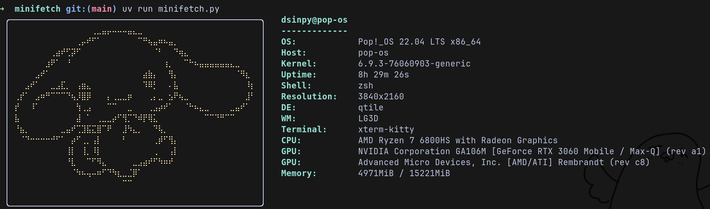

# minifetch
**Note: project was created for fun and not recommended for use.**

Repository serves as a [Neofetch](https://github.com/dylanaraps/neofetch) clone written in python.

## Running script
`git clone https://github.com/dsinpy/minifetch.git && cd minifetch`

To run a script [uv](https://github.com/astral-sh/uv) must be installed, then from project directory:

`uv run minifetch.py`

That will create .venv inside project, install all dependencies and then run a script. 

## Aliasing
If you want to have shell alias for the script, you can add this line to ~/.zshrc or ~/.bashrc:

`alias minifetch="uv --directory PATH_TO_MINIFETCH_DIR run minifetch.py"`

